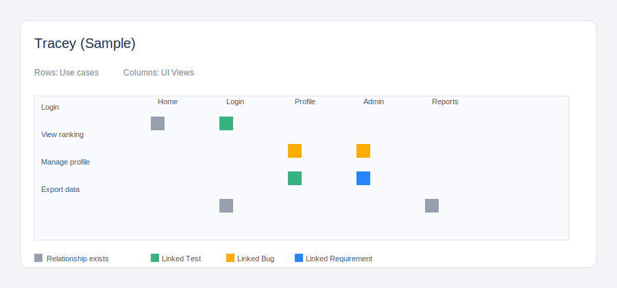

# Tracey for Jira Documentation

Tracey is a Jira Cloud app for traceability analysis, component coverage, story dependency mapping, and hierarchy cleanup. It runs inside Jira and helps teams understand how Jira issues connect to product areas, system components, requirements, stories, bugs, tests, and parent-child hierarchy.

Tracey is currently provided as a free beta app. Validate configuration and output in a test Jira project before using it for production decisions.

## How Tracey Works

Tracey reads Jira issue data from the Jira site where it is installed and builds traceability views directly inside Jira. The app uses standard Jira issue data, standard Jira issue links, Jira hierarchy fields, and Tracey-specific custom fields.

Tracey creates and uses these Jira custom fields:

| Field name | Type | Purpose |
| --- | --- | --- |
| Affected Components | Labels, multi-value | System components, UI areas, modules, or product areas touched by an issue |
| User Roles | Labels, multi-value | User roles affected by an issue |
| Permissions | Labels, multi-value | Permissions or access rules affected by an issue |
| DB Entities | Labels, multi-value | Database entities, tables, collections, or domain objects touched by an issue |
| Use cases | Labels, multi-value | Use cases, flows, or business scenarios affected by an issue |

Each field uses Jira's labels-style multi-value format, so teams can add values directly on Jira issues without predefining every option.

Tracey stores app configuration and saved view state in Atlassian Forge app storage. Jira issue data remains in Jira. Tracey does not require users to enter Atlassian passwords, PAT tokens, or external credentials.

## Key Features

### Components View

Components View shows Jira issues as rows and values from the `Affected Components` field as columns. A green cell means that the issue is linked to that component.

Use this view to answer questions such as:

- Which Jira issues affect a specific product area?
- Which components have the most planned work?
- Which issues have missing component coverage?
- Which stories, tasks, or bugs are related to a selected component?

Clicking a populated cell opens details for the matching issue or issues.

### Story-to-Story View

Story-to-Story View shows story-like issues as both rows and columns. Cells show standard Jira issue links between those issues.

Default link colors:

- Red: Blocks / is blocked by
- Purple: Duplicates / is duplicated by
- Yellow: Clones / is cloned by
- Grey: Relates to

Full cells mean the row issue points to the column issue. Half-filled cells mean the relation points from the column issue to the row issue. If a stronger relationship exists in the same cell, `Relates to` is hidden to reduce noise.

Use this view to inspect story dependencies, duplicates, clones, and related work before planning or release review.

### Hierarchical View

Hierarchical View displays Jira issue hierarchy as an interactive canvas. It supports zoom, pan, fit-to-view, fullscreen mode, parent coverage, standalone issue inspection, and optional relation lines.

Users can drag eligible leaf issues onto valid parent cards to assign hierarchy. Parent Coverage shows how many non-epic issues have a parent assigned.

Use this view to find:

- Stories or tasks without parents
- Epics with incomplete child structure
- Standalone issues that should be assigned into hierarchy
- Hierarchy gaps before sprint, release, or delivery review

### Issue Panel

Tracey adds an issue panel to Jira issue pages. The panel shows Tracey's traceability fields, grouped issue links, and a lightweight completeness summary for the current issue.

Use the issue panel when reviewing a single Jira issue and checking whether it has enough traceability metadata.

### Filtering

Tracey views can be filtered by:

- Issue type
- Epic
- Fix version
- Jira label
- Affected component
- Optional JQL

Story-to-Story View also includes a `Related only` option, which focuses the matrix on issues that have visible relationships.

## Admin Setup

These steps are intended for Jira administrators or project administrators testing Tracey after installation.

### 1. Install Tracey

Install Tracey from Atlassian Marketplace into a Jira Cloud site. During installation, Jira will ask for app permissions required to read Jira work items, create/find Tracey custom fields, store app configuration, and update issue parent relationships when users use drag-to-assign hierarchy.

### 2. Open Tracey Configuration

In Jira, open `Apps` or Jira administration, then open `Tracey Config`.

The configuration page is used to:

- Select which Jira issue types should be treated as story-like issues in Story-to-Story View.
- Optionally map Jira link types to the green, orange, or blue categories used by Tracey's story matrix logic.
- Re-run custom field provisioning if needed.

### 3. Confirm Custom Fields

Tracey provisions custom fields during installation. On the `Tracey Configuration` page, use `Provision fields` if fields need to be created or re-checked.

Confirm that these fields exist:

- `Affected Components`
- `User Roles`
- `Permissions`
- `DB Entities`
- `Use cases`

### 4. Configure Story Issue Types

In `Story issue types`, select the issue types your Jira site uses for story-level work, such as `Story`, `User Story`, or an equivalent custom issue type.

Save the configuration.

### 5. Optional Link Type Overrides

Tracey can infer colors from linked issue types, but admins can override link type mapping:

- `Green (Test)` for test-related link types
- `Orange (Bug)` for bug-related link types
- `Blue (Requirement)` for requirement-related link types

This step is optional. Save configuration after making changes.

## Preparing Test Data

Use a test Jira project with a small set of representative issues. A good test set includes:

- At least one epic or parent issue
- Several story-like issues
- At least one task or bug
- A few standard Jira issue links, such as blocks, duplicates, clones, or relates
- Values in Tracey custom fields, especially `Affected Components` and `Use cases`

Example values for `Affected Components`:

- Login
- Billing
- Reporting
- User Management

Example values for `Use cases`:

- Sign in
- Reset password
- Export report
- Manage subscription

## Step-by-Step Testing

### Test Components View

1. Open a Jira project where Tracey is installed.
2. Open `Tracey` from the project sidebar.
3. Select `Components View`.
4. Use filters if needed, or leave filters empty to load project issues.
5. Click `Refresh`.
6. Confirm that Jira issues appear as rows.
7. Confirm that values from `Affected Components` appear as columns.
8. Confirm that green cells appear where issues have matching affected components.
9. Click a populated cell and confirm that issue details are shown.

### Test Story-to-Story View

1. Open `Tracey` from the project sidebar.
2. Select `Story-to-Story View`.
3. Confirm that story-like issue types are configured in `Tracey Config`.
4. Add standard Jira issue links between story-like issues if the matrix is empty.
5. Click `Refresh`.
6. Confirm that story-like issues appear as both rows and columns.
7. Confirm that linked stories show colored cells.
8. Enable `Related only` to focus on issues with visible relationships.

### Test Hierarchical View

1. Open `Tracey` from the project sidebar.
2. Select `Hierarchical View`.
3. Click `Refresh`.
4. Confirm that issue cards appear in a hierarchy canvas.
5. Use `Zoom In`, `Zoom Out`, `Fit`, `Reset`, and `Full screen`.
6. Review the `Parent Coverage` widget.
7. Check `Standalone Issues` for issues that do not have a parent.
8. Drag an eligible leaf issue onto a valid parent card.
9. Confirm in Jira that the issue parent was updated.
10. Refresh Tracey and confirm that the hierarchy reflects the change.

### Test Issue Panel

1. Open a Jira issue in the project.
2. Open the `Tracey` issue panel.
3. Confirm that Tracey custom field values are shown.
4. Confirm that issue links are grouped.
5. Confirm that the completeness summary updates based on filled fields and linked issues.

### Test Filters

1. Open any Tracey view.
2. Select one or more issue types.
3. Select an epic, fix version, Jira label, or affected component.
4. Optionally enter a JQL condition.
5. Click `Refresh`.
6. Confirm that loaded issues match the selected filters.

## Permissions

Tracey uses these Forge scopes:

| Permission | Why Tracey needs it |
| --- | --- |
| `read:jira-work` | Read issues, issue types, statuses, priorities, issue links, project metadata, labels, components, fix versions, and custom field values |
| `write:jira-work` | Update issue parent relationships when a user uses drag-to-assign in Hierarchical View |
| `manage:jira-configuration` | Create and find Tracey custom fields |
| `storage:app` | Store app configuration and saved view state in Atlassian Forge app storage |

## Data Handling

Tracey runs on Atlassian Forge and uses Atlassian-hosted app execution and storage. Tracey does not operate a separate external backend for core app processing.

Tracey does not sell customer data and does not send Jira issue data to third-party analytics or advertising services.

For more detail, see the [Privacy Policy](privacy-policy.html).

## Troubleshooting

### Tracey view is empty

Check that the project has Jira issues matching the selected filters. Clear filters and click `Refresh`. Also confirm that the Jira user and installed app permissions allow access to the project data.

### Components View has no columns

Add values to the `Affected Components` field on one or more Jira issues, then refresh Tracey.

### Story-to-Story View has no colored cells

Confirm that story-like issue types are configured in `Tracey Config`. Then confirm that there are Jira issue links between the story-like issues loaded into the matrix.

### Hierarchical View has standalone issues

Standalone issues are issues that do not currently appear under a parent in the loaded hierarchy. Assign parents in Jira or drag eligible leaf issues onto valid parent cards from the hierarchy canvas.

### Custom fields are missing

Open `Tracey Config` and click `Provision fields`. If provisioning fails, confirm that the app has the `manage:jira-configuration` permission.

## Public Documents

- [Privacy Policy](privacy-policy.html)
- [Terms of Service](terms-of-service.html)
- [Support and Security Policy](support-and-security.html)

## Support

Support is provided on a best-effort basis by email.

For support or security questions, contact [eugenktheba@gmail.com](mailto:eugenktheba@gmail.com).
